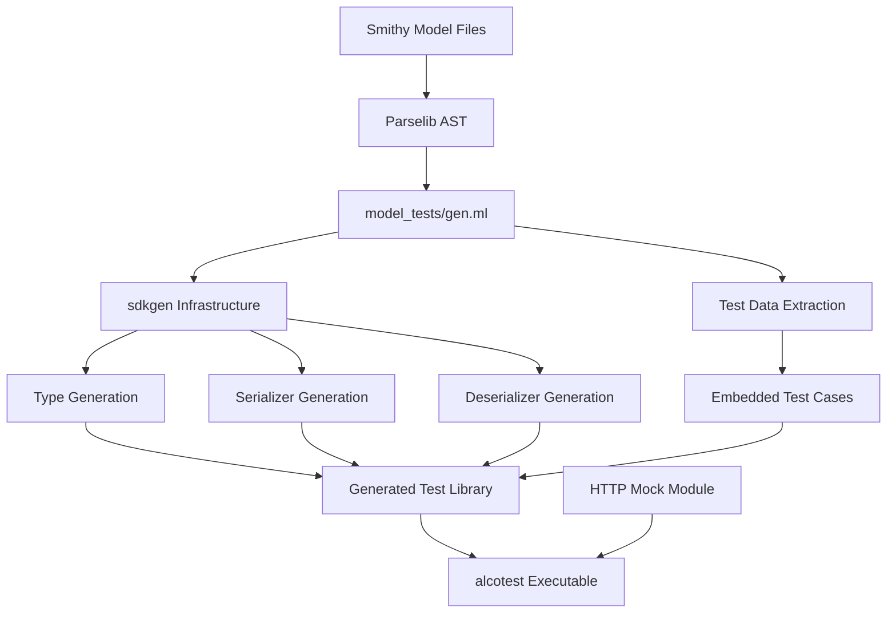

# Model Tests Design Document

## Overview

This document defines the technical architecture and design decisions for implementing Smithy protocol compliance testing in the smaws OCaml AWS SDK generator. The design leverages first-class modules for HTTP client substitution and generates self-contained test libraries that mirror production SDK structure.

## Architecture Overview

### High-Level Architecture

```
┌─────────────────┐    ┌──────────────────┐    ┌─────────────────────┐
│ Smithy Protocol │    │   Code Generator  │    │   Generated Test    │
│  Test Models    │───▶│   (model_tests/  │───▶│    Libraries        │
│     (.json)     │    │      gen.ml)      │    │  (per namespace)    │
└─────────────────┘    └──────────────────┘    └─────────────────────┘
                                │                           │
                                ▼                           ▼
                       ┌──────────────────┐    ┌─────────────────────┐
                       │    sdkgen/       │    │    alcotest Test    │
                       │ Infrastructure   │    │     Executables     │
                       │   (reused)       │    │                     │
                       └──────────────────┘    └─────────────────────┘
```

### Directory Structure Design

```
model_tests/
├── gen.ml                           # Updated generator (main implementation)
├── protocol_tests_json/             # aws.protocoltests.json namespace
│   ├── dune                         # Library + test executable  
│   ├── types.ml/mli                 # Generated types
│   ├── serializers.ml               # Request serialization
│   ├── deserializers.ml             # Response deserialization
│   ├── operations.ml/mli            # Operation interfaces
│   ├── service_metadata.ml          # Service details
│   ├── tests.ml                     # Embedded test data + alcotest runner
│   └── protocol_tests_json.ml       # Library entry point
├── protocol_tests_json10/           # aws.protocoltests.json10 namespace
│   └── [same structure]
├── protocol_tests_query/            # aws.protocoltests.query namespace
│   └── [same structure]  
└── protocol_tests_shared/           # aws.protocoltests.shared namespace
    └── [same structure]
```

## Design Decisions

### 1. First-Class Modules for HTTP Client Substitution

**Decision**: Use first-class modules instead of functors for HTTP client substitution in generated test code.

**Rationale**:
- Enables runtime selection of HTTP implementation
- Allows dynamic configuration of mock clients for different test scenarios  
- Maintains compatibility with existing functor-based protocol design
- Provides cleaner test instantiation syntax

**Implementation**: 
- Generated test code accepts `(module Http.Client_intf)` parameters
- Protocol instantiation uses first-class module unpacking: `let module Http = (val http_module) in ...`
- Test setup can dynamically create and configure mock HTTP modules

### 2. Self-Contained Test Data Embedding with Type-Safe Operation Calls

**Decision**: Embed all Smithy test specifications as OCaml data structures, with generated type-safe operation invocations for each test case.

**Rationale**:
- Eliminates external file dependencies and improves test reliability
- Enables static analysis and compilation-time validation of test data
- OCaml's strong typing requires compile-time knowledge of operation input types
- Cannot convert from generic JSON to specific types at runtime without type information
- Must generate actual operation calls rather than dynamic invocation

**Implementation Challenge**: 
OCaml has no runtime type information, so we cannot:
- Convert `Yojson.Basic.t` to arbitrary generated input types at runtime
- Dynamically invoke operations by string name like `operations["SomeOperation"](json_params)`

**Solution - Generated Type-Safe Test Functions**:
For each operation with test cases, generate a dedicated test function that:
1. Constructs the properly typed input from test parameters
2. Calls the actual operation with that typed input  
3. Validates the resulting HTTP request

```ocaml
(* Generated in tests.ml for each operation *)

(* Test data with typed input constructors *)
type no_input_and_no_output_test = {
  test_id : string;
  input_constructor : unit -> NoInputAndNoOutput.input;  (* Type-safe constructor *)
  expected_method : string;
  expected_uri : string; 
  expected_headers : (string * string) list;
  expected_body : string option;
}

let no_input_and_no_output_tests = [
  {
    test_id = "sends_requests_to_slash";
    input_constructor = (fun () -> ());  (* Construct typed input *)
    expected_method = "POST";
    expected_uri = "/";
    expected_headers = [("Content-Type", "application/x-amz-json-1.1")];
    expected_body = Some "{}";
  };
]

(* Generated test runner function *)
let test_no_input_and_no_output (http_module : (module Http.Client_intf)) test_case =
  let module Http = (val http_module) in
  let module Mock = Http_mock.Make(Http) in
  let mock_client = Mock.make () in
  
  (* Construct properly typed input *)
  let typed_input = test_case.input_constructor () in
  
  (* Call actual operation with typed input *)
  let _result = Operations.no_input_and_no_output 
                  ~http:mock_client 
                  ~input:typed_input in
  
  (* Validate captured HTTP request *)
  let captured = Mock.last_request () in
  assert_request_matches test_case captured

(* Similar pattern for complex input types *)
type describe_instances_test = {
  test_id : string;
  input_constructor : unit -> DescribeInstances.input;
  expected_method : string;
  expected_uri : string;
  expected_headers : (string * string) list;
  expected_body : string option;
}

let describe_instances_tests = [
  {
    test_id = "describe_instances_basic";
    input_constructor = (fun () -> 
      DescribeInstances.{
        instance_ids = Some ["i-1234567890abcdef0"];
        filters = None;
        max_results = Some 10;
      });
    expected_method = "POST";
    expected_uri = "/";
    expected_headers = [("Content-Type", "application/x-amz-json-1.1")];
    expected_body = Some {|{"InstanceIds":["i-1234567890abcdef0"],"MaxResults":10}|};
  };
]
```

**Code Generation Strategy**:
1. **Parse Test Parameters**: Extract `params` from Smithy `httpRequestTests`
2. **Generate Input Constructors**: For each test case, generate a function that constructs the proper OCaml input type from the test parameters
3. **Type-Safe Operation Calls**: Generate test functions that call actual operations with constructed inputs
4. **Static Validation**: All type construction happens at code generation time, validated at compile time

### 3. Mirror Production SDK Structure

**Decision**: Generate test libraries that exactly mirror the structure of production SDKs in `sdks/`.

**Rationale**:
- Maintains consistency with existing codebase patterns
- Enables reuse of existing `sdkgen` infrastructure
- Simplifies maintenance by following established conventions
- Makes test libraries self-documenting for developers

**Key Components**:
- `types.ml/mli` - Type definitions (reused from `sdkgen`)
- `serializers.ml` - Request serialization (exposed, unlike production)
- `deserializers.ml` - Response deserialization (exposed, unlike production)  
- `operations.ml/mli` - Operation signatures
- `service_metadata.ml` - Service configuration
- `tests.ml` - Test runner with embedded data

### 4. Namespace-Based Test Organization

**Decision**: Generate separate test libraries for each Smithy protocol namespace.

**Rationale**:
- Enables independent testing of different protocol variants
- Allows focused debugging of specific protocol issues
- Supports selective test execution via `dune runtest`
- Mirrors how Smithy organizes protocol specifications

**Namespace Mapping**:
- `aws.protocoltests.json` → `protocol_tests_json/`
- `aws.protocoltests.json10` → `protocol_tests_json10/`
- `aws.protocoltests.query` → `protocol_tests_query/` 
- `aws.protocoltests.shared` → `protocol_tests_shared/`

## Technical Architecture

### Component Interactions



### Core Interfaces

#### HTTP Client Interface (Existing)
```ocaml
module type Client_intf = sig
  type t
  type input_body = [`String of string | `Stream of string Seq.t]
  
  module Response : sig
    type t
    val status : t -> int
    val headers : t -> (string * string) list  
  end
  
  module Body : sig
    type t
    val to_string : t -> string
    val drain : t -> unit
  end
  
  val request :
    method_:Http.method_ ->
    uri:Uri.t ->
    ?headers:(string * string) list ->
    ?body:input_body ->
    t ->
    (Response.t * Body.t, Http.http_failure) result
end
```

#### Test Case Types (New)
```ocaml
(* Generic test case structure - generated per operation *)
type 'input request_test_case = {
  test_id : string;
  input_constructor : unit -> 'input;  (* Type-safe input constructor *)
  expected_method : string;
  expected_uri : string;
  expected_headers : (string * string) list;
  expected_body : string option;
  expected_query_params : (string * string) list option;
}

type 'output response_test_case = {
  test_id : string;
  mock_status : int;
  mock_headers : (string * string) list;
  mock_body : string option;
  expected_result_constructor : unit -> 'output;  (* Type-safe expected result *)
}

(* Concrete examples for specific operations *)
type no_input_test_case = unit request_test_case
type describe_instances_test_case = DescribeInstances.input request_test_case
type describe_instances_response_case = DescribeInstances.output response_test_case
```

### AST Extensions Required

#### New Trait Type (Missing)
```ocaml
(* Add to codegen/ast/Trait.ml *)
type httpResponseTest = {
  id : string;
  protocol : string;  
  code : int;
  headers : (string * string) list option;
  body : string option;
  bodyMediaType : string option;
  params : Yojson.Basic.t option;
  vendorParams : Yojson.Basic.t option;
  vendorParamsShape : string option;
  documentation : string option;
  tags : string list option;
  appliesTo : [ `Client | `Server ] option;
}

(* Add to trait union *)
| TestHttpResponseTests of httpResponseTest list
```

## Implementation Strategy

### Phase 1: Context Refactoring for First-Class Modules

**Current State**: `Context.t` hardcodes `Http.Client.t`
```ocaml
type t = { http : Http.Client.t; config : Config.t }
```

**Required Changes**:
1. **Parameterize Context**: Make `Context.t` generic over HTTP client type
```ocaml
type 'http t = { http : 'http; config : Config.t }
type context = Http.Client.t t  (* Default context type *)
```

2. **Update Protocol Implementations**: Modify `awssdklib/AwsJson.ml` to accept first-class modules
```ocaml
val request_with_http :
  http_module:(module Http.Client_intf with type t = 'http) ->
  http:'http ->
  (* ... existing parameters ... *) ->
  ('res, 'error) result
```

3. **Update Generated Operations**: Modify operation generation to extract HTTP module from context and call new AwsJson API
```ocaml
(* Current generated operation calls *)
let some_operation ~context ~input =
  let http = context.http in
  AwsJson.Make(Http.Client).request ~http ~input (* ... *)

(* New generated operation calls with first-class modules *)
let some_operation ~context ~input =
  let http = context.http in
  let http_module = (module Http.Client : Http.Client_intf with type t = Http.Client.t) in
  AwsJson.request_with_http ~http_module ~http ~input (* ... *)

(* For tests: enable custom HTTP module injection *)
let some_operation_with_http ~http_module ~http ~config ~input =
  AwsJson.request_with_http ~http_module ~http ~config ~input (* ... *)
```

4. **Backward Compatibility**: Maintain existing API surface for production SDKs

### Phase 2: AST and Parser Extensions

**Missing Components**:
1. Add `httpResponseTest` type to `Trait.ml`
2. Add `TestHttpResponseTests` variant to trait union
3. Extend `codegen/parse/Smithy.ml` to parse `smithy.test#httpResponseTests`
4. Ensure filtering for AWS JSON protocols works for response tests

### Phase 3: Test Code Generator with Deriving Support

**Core Generation Logic**:
```ocaml
(* In model_tests/gen.ml *)
let generate_test_library namespace shapes =
  let service, operations = extract_service_and_operations shapes in
  let request_tests = extract_request_tests operations in
  let response_tests = extract_response_tests operations in
  
  (* Reuse sdkgen for core components with test-specific modifications *)
  generate_types_with_deriving namespace shapes;  (* Add [@@deriving show, equal] *)
  generate_serializers namespace shapes;  
  generate_deserializers namespace shapes;
  generate_operations_with_http_injection namespace shapes;  (* Add HTTP module injection *)
  generate_service_metadata namespace service;
  
  (* Generate test-specific code *)
  generate_embedded_tests namespace request_tests response_tests;
  generate_test_runner namespace;
  generate_dune_file namespace;
```

**Critical Modification - Types with Deriving Annotations**:
```ocaml
(* Standard production type generation *)
type describe_instances_input = {
  instance_ids : string list option;
  filters : filter list option;
  max_results : int option;
}

(* Test library type generation - with deriving for comparisons *)
type describe_instances_input = {
  instance_ids : string list option;
  filters : filter list option;
  max_results : int option;
} [@@deriving show, equal]

type describe_instances_output = {
  reservations : reservation list option;
  next_token : string option;
} [@@deriving show, equal]
```

**Why Deriving is Essential**:
- **Request Tests**: Need `equal` to compare constructed input with expected input
- **Response Tests**: Need `equal` to compare deserialized output with expected output  
- **Debugging**: Need `show` to display differences in test failures
- **Test Assertions**: Enable `assert (InputType.equal expected actual)`

**Example: Smithy Test Params to OCaml Code Generation**

Given a Smithy protocol test with the following structure:

*Smithy Type Definition:*
```smithy
structure DescribeInstancesInput {
    InstanceIds: InstanceIdStringList,
    Filters: FilterList,
    MaxResults: Integer
}

list InstanceIdStringList {
    member: InstanceId
}

string InstanceId

structure Filter {
    Name: String,
    Values: ValueStringList
}

list FilterList {
    member: Filter
}
```

*Smithy Test Case:*
```json
{
  "id": "ec2_describe_instances_basic", 
  "protocol": "aws.protocols#awsJson1_0",
  "params": {
    "InstanceIds": ["i-1234567890abcdef0", "i-0987654321fedcba0"],
    "Filters": [
      {
        "Name": "instance-state-name",
        "Values": ["running", "pending"]
      }
    ],
    "MaxResults": 10
  }
}
```

*Generated OCaml Code:*
```ocaml
(* Generated type with deriving annotations *)
type describe_instances_input = {
  instance_ids : string list option;
  filters : filter list option; 
  max_results : int option;
} [@@deriving show, equal]

and filter = {
  name : string option;
  values : string list option;
} [@@deriving show, equal]

(* Generated test case constructor from Smithy params *)
let ec2_describe_instances_basic_test = {
  test_id = "ec2_describe_instances_basic";
  input_constructor = (fun () -> 
    DescribeInstances.{
      instance_ids = Some ["i-1234567890abcdef0"; "i-0987654321fedcba0"];
      filters = Some [
        Filter.{
          name = Some "instance-state-name";
          values = Some ["running"; "pending"];
        }
      ];
      max_results = Some 10;
    });
  expected_method = "POST";
  expected_uri = "/";
  expected_headers = [("Content-Type", "application/x-amz-json-1.0")];
  expected_body = Some {|{"InstanceIds":["i-1234567890abcdef0","i-0987654321fedcba0"],"Filters":[{"Name":"instance-state-name","Values":["running","pending"]}],"MaxResults":10}|};
}
```

**Code Generation PPX Process**:
```ocaml
(* In model_tests/gen.ml - params to constructor generation *)
let generate_input_constructor_from_params operation_name smithy_input_shape test_params =
  let rec convert_param_value smithy_type json_value =
    match smithy_type, json_value with
    | StringShape, `String s -> sprintf "Some %S" s
    | IntegerShape, `Int i -> sprintf "Some %d" i  
    | ListShape member_shape, `List values ->
        let converted_values = List.map (convert_param_value member_shape) values in
        sprintf "Some [%s]" (String.concat "; " converted_values)
    | StructureShape fields, `Assoc assoc ->
        let field_assignments = List.filter_map (fun (smithy_field, ocaml_field) ->
          match List.Assoc.find assoc smithy_field with
          | Some json_val -> 
              let converted = convert_param_value smithy_field.type_ json_val in
              Some (sprintf "%s = %s" ocaml_field converted)
          | None -> Some (sprintf "%s = None" ocaml_field)
        ) fields in
        sprintf "%s.{%s}" (module_name_of_shape smithy_input_shape)
                         (String.concat "; " field_assignments)
    | OptionalShape inner_shape, json_val ->
        convert_param_value inner_shape json_val
    | _, `Null -> "None"
  in
  
  sprintf "(fun () -> %s)" (convert_param_value smithy_input_shape test_params)
```

This approach:
1. **Parses Smithy Type Definitions** to understand the expected OCaml structure
2. **Traverses Test Params JSON** recursively to build constructor expressions  
3. **Generates Type-Safe Constructors** that build proper OCaml values at compile time
4. **Handles Optional Types** correctly (Some/None wrapping)
5. **Maintains Type Safety** - all conversions validated at code generation time

**Test Execution Strategy**:
```ocaml
(* Generated in tests.ml - type-safe per-operation test runners *)

(* Example for NoInputAndNoOutput operation *)
let test_no_input_and_no_output (http_module : (module Http.Client_intf)) 
                                 (test_case : no_input_test_case) =
  let module Http = (val http_module) in
  let module Mock = Http_mock.Make(Http) in
  let mock_client = Mock.make () in
  
  (* Construct typed input using generated constructor *)
  let typed_input = test_case.input_constructor () in
  
  (* Call actual operation with properly typed input *)
  let _result = Operations.no_input_and_no_output ~http:mock_client ~input:typed_input in
  
  (* Validate captured HTTP request *)
  let captured = Mock.last_request () in
  assert_request_matches test_case captured

(* Example for operation with complex input type *)
let test_describe_instances (http_module : (module Http.Client_intf)) 
                           (test_case : describe_instances_test_case) =
  let module Http = (val http_module) in
  let module Mock = Http_mock.Make(Http) in  
  let mock_client = Mock.make () in
  
  (* Construct typed input - no runtime JSON conversion needed *)
  let typed_input = test_case.input_constructor () in
  
  (* Call actual operation - leverages existing serialization code *)
  let _result = Operations.describe_instances ~http:mock_client ~input:typed_input in
  
  (* Validate serialized request matches expected *)
  let captured = Mock.last_request () in
  assert_request_matches test_case captured

(* Response test with type-safe deserialization validation *)
let test_describe_instances_response (http_module : (module Http.Client_intf))
                                   (test_case : describe_instances_response_case) =
  let module Http = (val http_module) in
  let module Mock = Http_mock.Make(Http) in
  let mock_client = Mock.make () in
  
  (* Configure mock HTTP response *)
  Mock.mock_response ~status:test_case.mock_status 
                    ~headers:test_case.mock_headers
                    ~body:test_case.mock_body ();
  
  (* Execute operation - triggers deserialization *)
  let result = Operations.describe_instances ~http:mock_client 
                                           ~input:(DescribeInstances.{
                                             instance_ids = None; 
                                             filters = None; 
                                             max_results = None;
                                           }) in
  
  (* Validate deserialized result matches expected *)
  let expected = test_case.expected_result_constructor () in
  assert_response_matches expected result
```

**Key Benefits of Type-Safe Approach**:
1. **Compile-Time Validation**: All test data construction is validated at compile time
2. **No Runtime Type Errors**: Cannot have mismatched input/output types  
3. **IDE Support**: Full OCaml tooling support for test case construction
4. **Refactoring Safety**: Changes to operation types automatically break incompatible tests

### Phase 4: Build Integration

**Dune Configuration**:
```ocaml
(* Generated dune file for each namespace *)
(library
 (name protocol_tests_json)
 (modules types serializers deserializers operations service_metadata protocol_tests_json)
 (libraries smaws-lib yojson base))

(executable
 (name tests)
 (modules tests)
 (libraries protocol_tests_json alcotest smaws-lib))

(rule
 (alias runtest)
 (deps (:exe ./tests.exe))
 (action (run %{exe})))
```

## Data Flow Architecture

### Request Test Flow
1. **Test Setup**: Create mock HTTP client with first-class module
2. **Input Processing**: Convert test `params` to operation input
3. **Serialization**: Call generated serializer functions
4. **HTTP Capture**: Mock client captures outgoing HTTP request
5. **Validation**: Assert captured request matches expected HTTP details

### Response Test Flow  
1. **Test Setup**: Create mock HTTP client, configure canned response
2. **Mock Response**: Set up mock with expected status, headers, body
3. **Deserialization**: Execute operation, triggers response parsing
4. **Validation**: Assert parsed result matches expected output params

## Error Handling Strategy

### Test Failure Diagnostics
- **Request Mismatches**: Show diff between expected vs actual HTTP details
- **Response Parse Errors**: Include raw response body in failure messages
- **Serialization Errors**: Display input params and generated JSON
- **Protocol Errors**: Contextualize failures with test case ID and operation

### Graceful Degradation
- **Missing Test Data**: Skip tests with warning rather than failing
- **Unsupported Protocols**: Filter out non-JSON protocol tests gracefully  
- **Parse Failures**: Log errors but continue with other test cases

## Security Considerations

### Test Data Sanitization  
- **No Secrets**: Ensure embedded test data contains no real AWS credentials
- **Sanitized Inputs**: Validate that test parameters don't contain sensitive data
- **Safe Mock Responses**: Review generated response data for potential information leakage

### Network Isolation
- **Mock-Only Testing**: All tests use mock HTTP clients, no real network calls
- **Localhost Binding**: If network stubs needed, bind only to localhost
- **Request Validation**: Assert tests don't attempt real AWS API calls

## Performance Considerations

### Generation Performance
- **Incremental Generation**: Only regenerate changed namespaces
- **Parallel Processing**: Generate multiple namespaces concurrently  
- **Memory Efficiency**: Stream large test data rather than loading entirely in memory

### Test Execution Performance  
- **Fast Mocks**: HTTP mocks should have minimal overhead
- **Parallel Tests**: Run namespace test suites in parallel where possible
- **Selective Execution**: Support running specific test subsets during development

## Monitoring and Observability

### Test Metrics
- **Coverage Tracking**: Report % of protocol operations covered by tests
- **Performance Monitoring**: Track test execution time per namespace
- **Failure Classification**: Categorize test failures (serialization, deserialization, etc.)

### Debugging Support
- **Verbose Mode**: Optional detailed logging of HTTP requests/responses
- **Test Isolation**: Ability to run individual test cases for debugging
- **Diff Visualization**: Clear display of expected vs actual differences

## Future Extensibility

### Protocol Support
- **Design for Extension**: Architecture supports adding REST-XML, Query protocols
- **Plugin Architecture**: Consider plugin system for protocol-specific test generation
- **Configurable Filtering**: Support custom protocol filtering beyond JSON 1.0/1.1


## Dependencies and Integration Points

### Build System Integration
- **Dune Compatibility**: Generated build files integrate seamlessly with existing dune setup
- **CI Pipeline**: Tests run as part of standard `dune runtest` workflow
- **Artifact Management**: Generated libraries follow existing naming and packaging conventions

### External Dependencies  
- **Minimal Additions**: No new external dependencies beyond existing alcotest, yojson, base
- **Version Compatibility**: Ensure compatibility with current library versions
- **Optional Dependencies**: Consider making some test features optional to reduce dependency burden

This design provides a comprehensive, extensible foundation for Smithy protocol compliance testing while maintaining consistency with the existing smaws architecture and development practices.